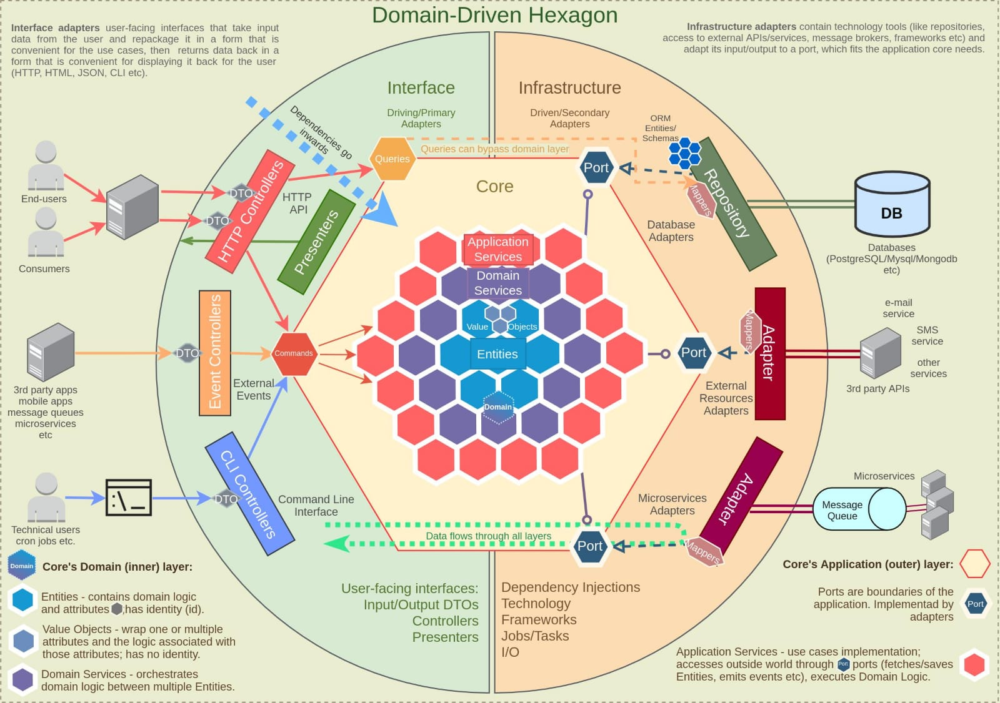

## Arsitektur
<hr/>
Menggunakan Heksagonal arsitektur, dimana service ini dipisah menjadi 3 bagan besar yaitu blok kiri(interface), blok tengah(core), dan blok kanan (infrastructure).

#### Perhatikan gambar berikut:


### Blok kiri (Interface)
Merupakan bagian antarmuka yang digunakan mengambil input data dari user(client) kemudian mengemas nya kembali untuk dikirimkan ke usecase(alur bisnis), dan mengembalikan kepada client requestor.

### Blok tengah (Core)
Merupakan bagian inti dari sebuah service(bussines logic), inti/core ini tidak asal di inject/dipanggil, tetapi wajib melalui sebuah port. Port adalah sebuah interface yang sudah di inisiasi bersamaan ketika core dibuat.

### Blok Kanan (Infrastructure)
Bagian Kanan ini biasanya menyimpan kumpulan teknologi yang digunakan dalam membangun service(bukan bussiness logic), seperti repository, third-party, dll

### Ihtisar
Oleh karena itu, berikut ini adalah susunan folder yang dibangun berdasarkan arsitektur heksagonal

```
├── app             #tempat untuk init framework echo dan init DB
├── core
    ├── entities    # berisi kumpulan entities dan domain logicnya
    ├── port
        ├── user    # berisi kumpulan method interface inport dan outport
    ├── service     # berisi service yang exec domain logic
       ├── user.go              
├── infrastructure 
    ├── repository
        ├── mysql       # berisi init koneksi dan querynya
            ├── adapter # berisi method yang mengubah entity menjadi model
            ├── adapter # kumpulan model yang merepresentasikan structure table
    ├── usergateway.go  # inject infrastructure untuk dikonsumsi app
├── interface
    ├── rest
        ├── user        # berisi handler dan payload (response dan request)  
        ├── router.go   # route 
├── shared              # berisi helper library
├── test                # berisi mock
```